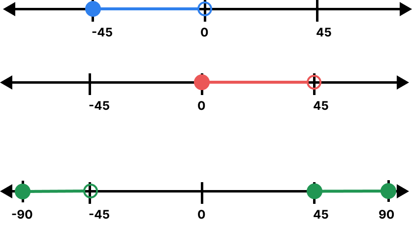
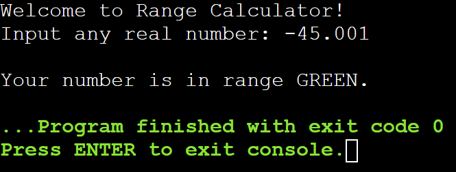

# Lab Assignment 08

In this lab you will practice working with ranges and intervals.

Same as the previous labs, you need to set up your workspace (class and main() method).

## Let's get started!

First, let's look at the name of our .java file in the `src/` directory and name your class accordingly and remember to make it `public`. Next, **create your main() method inside your class**.

Now let's begin!

### Ranges and Intervals

An interval is measured in terms of numbers. An interval includes all the real numbers that come between two particular numbers.

### Interval Notation

Interval notation is written using square `[ ]` or `( )` round brackets to indicate the range between two numbers.

* A square bracket `[ ]`, if we want to **include the endpoints** 
* A round bracket `( )`, if we want to **exclude the endpoints**

**Example**

* `[6, 20]` if the interval includes 6 and 20
* `(6, 20)` if the interval excludes 6 and 20 
* `(6, 20]` if the interval excludes 6 but includes 20
* `[6, 20)` if the interval includes 6 but excludes 20 

## Your program

### Range Calculator

For this assignment you will practice working with the following ranges.

* **BLUE:** `[-45, 0)`
* **RED:** `[0, 45)`
* **GREEN:** `[-90, -45)` and `[45, 90]`

Prompt the user to input any real number, then output the color of the range their number is in.

**Expected Output:**

## Submit your assignment

To submit your lab assignment click on the **Source Control** icon (3 circles with 2 lines) on your leftside navbar. Next, click on the **+** symbol next to **Changes** to stage your changes. Lastly, add a commit message (ex: "First commit") and click **Commit** then **Sync Changes**. And you're done!
